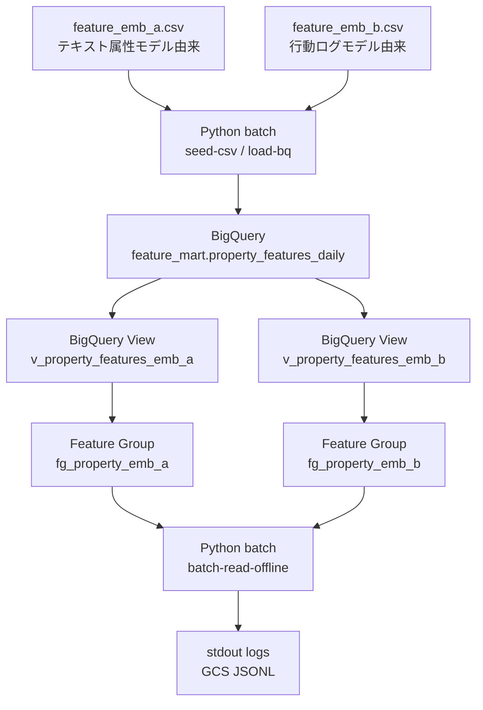
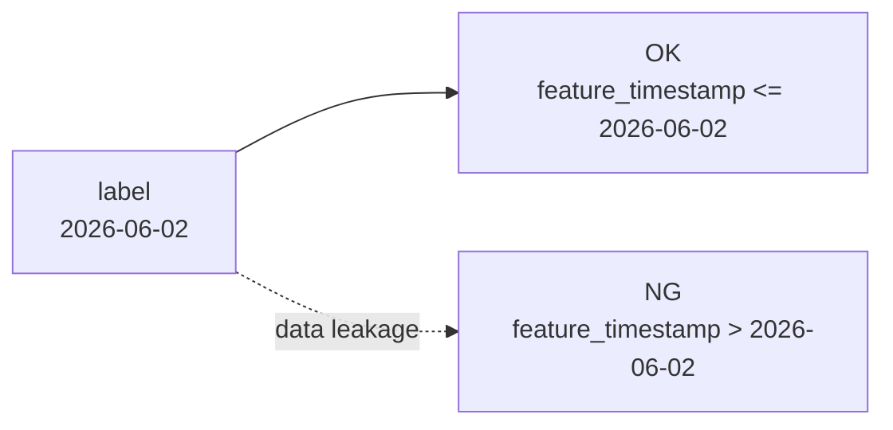

# Feature Store 入門 — Offline / BigQuery 連携に絞って理解する

このドキュメントは、Vertex AI Feature Store を初めて触る人が、本リポジトリの仕様に沿って **Offline Feature Store** を理解するための入門です。

本プロジェクトの正本は [02_仕様書.md](02_仕様書.md) です。この入門では、仕様書の構成を崩さずに「なぜその構成にしているのか」「Feature Store Offline では何がうれしいのか」を説明します。

重要な前提として、このプロジェクトでは次を扱いません。

- Feature Store Online
- Online Store
- Feature View
- Feature View sync
- Redis 連携
- 低レイテンシ serving
- 推論 Endpoint

焦点は、BigQuery 上の特徴量を Feature Store の Feature Group / Feature として管理し、Python batch からオフライン特徴量として取得することです。

---

## 1. このプロジェクトで学ぶこと

Feature Store という名前から online serving まで含めて想像しがちですが、本プロジェクトでは Offline の価値に絞ります。

```text
CSV
  → BigQuery
  → Feature Store Feature Group / Feature
  → Python batch
  → stdout ログ + GCS JSONL
```

この流れで学ぶ中心は、次の責務分離です。

| レイヤー | 役割 |
|---|---|
| `feature_emb_a.csv` / `feature_emb_b.csv` | 学習用の固定サンプル入力 |
| BigQuery | 特徴量データの実体、履歴、SQL 確認、batch 取得 |
| Feature Group | BigQuery の特徴量テーブル / View を Feature Store 管理下に置く単位 |
| Feature | BigQuery 上の各特徴量カラムを、Feature Store 上の特徴量として登録する単位 |
| Python batch | Feature Store で管理された BigQuery 特徴量を downstream 用に取得する処理 |

Feature Store Offline は「BigQuery にある特徴量を、ML 用の特徴量としてカタログ化・再利用しやすくする管理レイヤー」と考えると理解しやすいです。

---

## 2. なぜ Offline に絞るのか

Feature Store には Online Store を使った低レイテンシ配信の文脈もあります。しかし、本プロジェクトでは既存システムの online 配信は Redis が担っている前提です。

ここで Feature Store Online まで追加すると、次のような複雑さが増えます。

- Redis と Online Store の責務が重複する
- offline から online への sync 経路が増える
- 低レイテンシ serving の障害点が増える
- 学習テーマが Feature Store 全般に広がりすぎる

そのため、今回は Feature Store の導入価値を次に限定します。

```text
BigQuery 上の特徴量を
Feature Group / Feature として管理し、
offline batch で取得・検証できる状態を作る
```

Online Store を使わなくても、Feature Store の「特徴量を管理対象として明示する」価値は学べます。

---

## 3. Offline Feature Store の全体像

仕様書のデータフローを、入門用に少し言い換えると次のようになります。



ポイントは、特徴量の実体は BigQuery に置き続けることです。

Feature Store は BigQuery の代替データベースではありません。このプロジェクトでは、BigQuery のテーブル / View を Feature Store の Feature Group / Feature として登録し、特徴量の意味・所属・Entity ID を明確にします。

---

## 4. 主要概念

Vertex AI Feature Store の用語を、本プロジェクトの実体に対応づけるとこうなります。

| Feature Store 用語 | 意味 | 本プロジェクト |
|---|---|---|
| Entity | 特徴量を紐づける対象 | 不動産物件 |
| Entity ID | Entity を一意に識別する ID | `property_id` |
| Feature | 特徴量カラム | `rent`, `walk_min`, `emb_a_ctr` など |
| Feature Group | 特徴量群を Feature Store に登録する単位 | `fg_property_emb_a`, `fg_property_emb_b` |
| Feature timestamp | いつ時点の特徴量か | `feature_timestamp` |
| Offline store | 大量データを batch / 分析で読む実体 | BigQuery |

このプロジェクトでは、Feature Group を embedding source ごとに分けます。

```text
fg_property_emb_a
  Entity ID: property_id
  Source: feature_mart.v_property_features_emb_a
  Features:
    rent
    walk_min
    age_years
    area_m2
    emb_a_ctr
    emb_a_fav_rate
    emb_a_semantic_score

fg_property_emb_b
  Entity ID: property_id
  Source: feature_mart.v_property_features_emb_b
  Features:
    rent
    walk_min
    age_years
    area_m2
    emb_b_inquiry_rate
    emb_b_collab_score
    emb_b_engagement
```

---

## 5. BigQuery が「特徴量の実体」

Offline Feature Store を理解するときに一番大事なのは、BigQuery が特徴量の実体であることです。

本プロジェクトでは、特徴量は次のテーブルに集約されます。

```text
mlops-dev-a.feature_mart.property_features_daily
```

このテーブルは次の性質を持ちます。

| 列 | 役割 |
|---|---|
| `event_date` | 日次 partition |
| `feature_timestamp` | 特徴量が有効な時点 |
| `property_id` | Entity ID |
| `embedding_source` | `emb_a` / `emb_b` のリネージュ |
| `rent`, `walk_min`, `age_years`, `area_m2` | 共通特徴量 |
| `emb_a_*` | テキスト属性モデル由来の特徴量 |
| `emb_b_*` | 行動ログモデル由来の特徴量 |

`embedding_source` はこの仕様で重要な列です。同じ `property_id` でも、`emb_a` と `emb_b` では由来の違う特徴量を持つため、1 つの BigQuery テーブルにまとめたうえで、source 別に View を切ります。

```sql
-- emb_a の取得イメージ
SELECT
  property_id,
  rent,
  walk_min,
  age_years,
  area_m2,
  emb_a_ctr,
  emb_a_fav_rate,
  emb_a_semantic_score
FROM `mlops-dev-a.feature_mart.property_features_daily`
WHERE event_date = CURRENT_DATE("Asia/Tokyo")
  AND embedding_source = 'emb_a'
ORDER BY property_id;
```

Feature Store の登録対象は、この BigQuery テーブルから作る `emb_a` / `emb_b` 用の View です。

---

## 6. なぜ Feature Group を 2 つに分けるのか

BigQuery の元テーブルは 1 つですが、Feature Group は次の 2 つに分けます。

| BQ View | Feature Group | 意味 |
|---|---|---|
| `feature_mart.v_property_features_emb_a` | `fg_property_emb_a` | テキスト属性モデル由来の特徴量セット |
| `feature_mart.v_property_features_emb_b` | `fg_property_emb_b` | 行動ログモデル由来の特徴量セット |

分ける理由は、Feature Group が「この特徴量セットは何由来で、どのカラムを Feature として公開するか」を表す単位だからです。

もし 1 つの Feature Group に `emb_a_*` と `emb_b_*` を全部入れると、次のような読みづらさが出ます。

- `emb_a` の行では `emb_b_*` が NULL になる
- `emb_b` の行では `emb_a_*` が NULL になる
- downstream batch がどの特徴量セットを読んでいるのか分かりにくい
- lineage が Feature Group 名から見えにくい

そこで、BigQuery では 1 テーブルに集約し、Feature Store では source 別に Feature Group を分けます。

```text
BigQuery: 1 テーブルで履歴・管理を集約
Feature Store: 2 Feature Group で利用単位を明確化
```

---

## 7. Offline batch は何を確認するのか

`batch-read-offline` は online serving ではありません。Cloud Run Job またはローカル Python batch として実行し、対象日の特徴量を source 別に取得します。

確認したいことは次の 4 つです。

| 確認 | 内容 |
|---|---|
| BigQuery に特徴量がある | `property_features_daily` に `emb_a` / `emb_b` が投入済み |
| Feature Store に登録されている | `fg_property_emb_a` / `fg_property_emb_b` と Feature が存在する |
| source 別に読める | `emb_a` / `emb_b` の特徴量セットを混ぜずに取得できる |
| downstream に渡せる形になる | stdout と GCS JSONL に `property_id` 単位で出力できる |

出力例は仕様書と同じです。

```text
[offline-feature][emb_a] property_id=p001 rent=85000 walk_min=7 age_years=12 area_m2=32.5 emb_a_ctr=0.12 emb_a_fav_rate=0.03 emb_a_semantic_score=0.72
[offline-feature][emb_b] property_id=p001 rent=85000 walk_min=7 age_years=12 area_m2=32.5 emb_b_inquiry_rate=0.01 emb_b_collab_score=0.65 emb_b_engagement=0.40
```

この結果が出れば、「Feature Store 管理下の BigQuery 特徴量を offline batch で利用できる」状態を確認できます。

---

## 8. feature_timestamp と point-in-time の考え方

このプロジェクトではモデル学習までは行いませんが、`feature_timestamp` を持たせます。

理由は、offline 特徴量では「いつ時点の特徴量か」が重要だからです。例えば、2026-06-02 のラベルに対して、2026-06-03 に計算された特徴量を使うと、未来の情報を見てしまいます。



今回の batch は対象日の特徴量をログに出すだけですが、将来 training dataset を作るなら、`feature_timestamp` を使って point-in-time join を行います。

Feature Store Offline を学ぶときは、Feature Group / Feature の登録だけでなく、`feature_timestamp` を持つ設計にしておくことが重要です。

---

## 9. 実装時の読み順

このプロジェクトを触るときは、次の順で読むと迷いにくいです。

1. [02_仕様書.md](02_仕様書.md)
2. [01_Feature-store入門.md](01_Feature-store入門.md)
3. [03_実装カタログ.md](03_実装カタログ.md)
4. [05_運用.md](05_運用.md)

実装フローは仕様書のコマンドに対応します。

```bash
python -m app.main seed-csv
python -m app.main load-bq
python -m app.main register-fs
python -m app.main batch-read-offline
```

各コマンドの役割は次の通りです。

| コマンド | 役割 |
|---|---|
| `seed-csv` | `feature_emb_a.csv` / `feature_emb_b.csv` を作成 |
| `load-bq` | BigQuery テーブルへロードし、View を用意 |
| `register-fs` | Feature Group / Feature を登録 |
| `batch-read-offline` | source 別に offline 特徴量を取得してログ・JSONL 出力 |

---

## 10. よくある誤解

### Feature Store を使うなら Online Store も必要？

不要です。このプロジェクトでは Online Store を作りません。

Feature Store Offline の目的は、BigQuery 上の特徴量を Feature Group / Feature として管理し、batch や training 用に再利用しやすくすることです。

### Feature Group はデータをコピーする場所？

この仕様では、データの実体は BigQuery です。Feature Group は、BigQuery の特徴量ソースを Feature Store 上で管理するためのメタデータに近い役割です。

### Redis を置き換えるのが目的？

違います。Redis は既存の online 低レイテンシ配信の責務を持つ前提です。このプロジェクトでは Redis に触りません。

### batch-read-offline は Feature Store API だけで値を取る？

この仕様では、BigQuery を offline store として扱い、Feature Store 管理下の特徴量を batch で取得できることを確認します。実体データの取得は BigQuery の対象 View / テーブルを読む設計です。

---

## 11. いつ Offline Feature Store が効くか

Offline に限定しても、Feature Store が効く場面はあります。

| 効く場面 | 理由 |
|---|---|
| 複数 batch / 複数モデルで特徴量を共有する | Feature Group / Feature として管理単位を明示できる |
| 特徴量の lineage を残したい | `embedding_source` と Feature Group 名で由来を追いやすい |
| BigQuery の特徴量テーブルが増えてきた | ML 用特徴量として公開する列を Feature として整理できる |
| training dataset 作成を見据えている | `feature_timestamp` を使った point-in-time 設計につなげやすい |
| online serving は既に別基盤がある | Offline だけ導入し、責務重複を避けられる |

逆に、特徴量が数列しかなく、利用者も 1 batch だけなら、Feature Store を入れずに BigQuery SQL だけで十分な場合もあります。

---

## 12. この入門の到達点

この入門で押さえるべき結論は次の 3 つです。

```text
1. BigQuery が特徴量の実体である
2. Feature Store は Feature Group / Feature として特徴量を管理する
3. 本プロジェクトでは Offline batch 取得までを検証し、Online 系は扱わない
```

最終的には、仕様書の成功条件どおり次の状態になれば完了です。

```text
feature_emb_a.csv / feature_emb_b.csv
  → BigQuery
  → BQ View emb_a / emb_b
  → Feature Group × 2 / Feature × 7 × 2
  → Python batch offline read
  → stdout ログ + GCS JSONL
```
