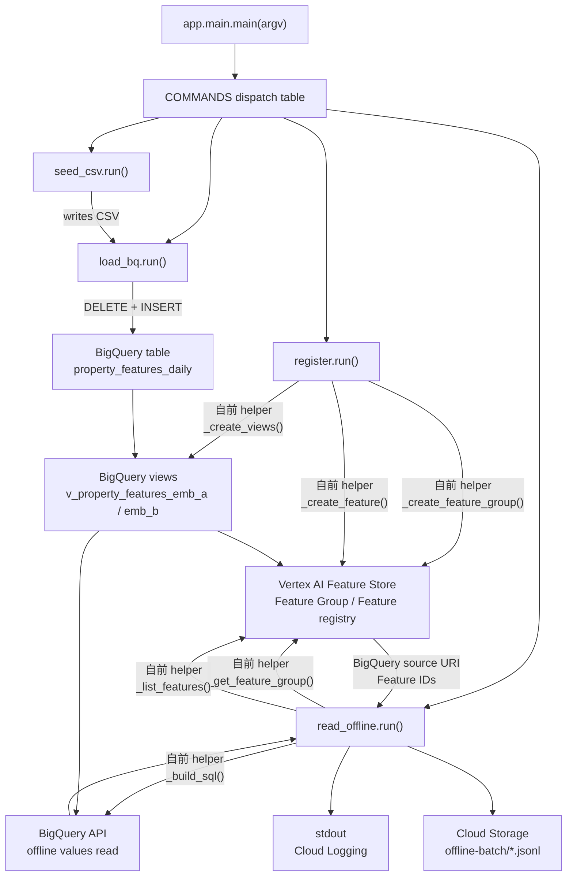
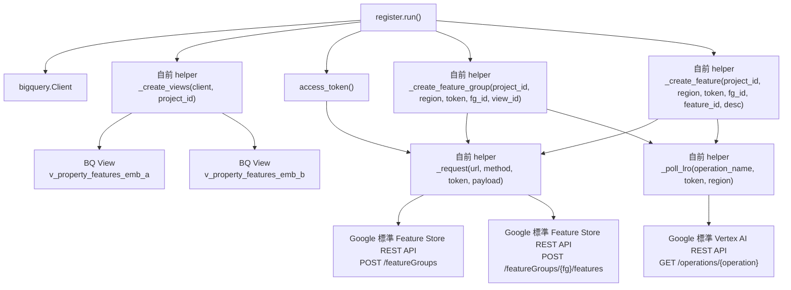
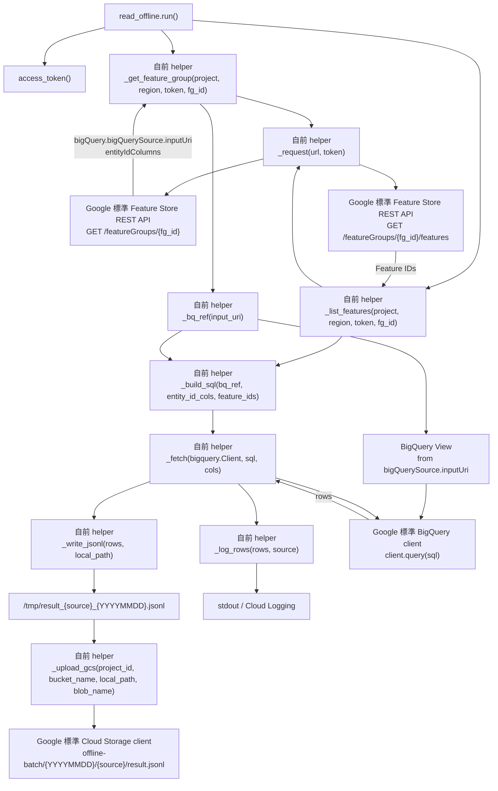

# 重要コード説明 — Feature Store Offline 連携

このドキュメントは、今回実装した Feature Store Offline 連携の重要コードを読むためのガイドです。

結論から言うと、この実装では **Feature Store REST API は Feature Group / Feature の registry metadata 取得に使い、実データの取得は BigQuery API で行います**。Online Store / Feature View / sync / `fetchFeatureValues` / Redis は使いません。

このドキュメントで「メソッド」と呼んでいるものには、Google 標準 API と、このリポジトリで定義した自前ヘルパ関数が混ざります。まず区別を固定します。

| 区分 | 名前 | 標準 / 自前 | 役割 |
|---|---|---|---|
| Feature Store REST API | `POST /featureGroups?featureGroupId=...` | Google 標準 | Feature Group を作成する |
| Feature Store REST API | `POST /featureGroups/{fg}/features?featureId=...` | Google 標準 | Feature を作成する |
| Feature Store REST API | `GET /featureGroups/{fg}` | Google 標準 | Feature Group metadata を取得する |
| Feature Store REST API | `GET /featureGroups/{fg}/features` | Google 標準 | Feature 一覧を取得する |
| Feature Store REST API | `GET /operations/{operation}` | Google 標準 | LRO の完了状態を確認する |
| Python helper | `_create_feature_group()` | 自前 | 標準 API `POST /featureGroups` を呼ぶ薄いラッパ |
| Python helper | `_create_feature()` | 自前 | 標準 API `POST /features` を呼ぶ薄いラッパ |
| Python helper | `_get_feature_group()` | 自前 | 標準 API `GET /featureGroups/{fg}` を呼ぶ薄いラッパ |
| Python helper | `_list_features()` | 自前 | 標準 API `GET /features` を呼ぶ薄いラッパ |
| Python helper | `_build_sql()` | 自前 | Feature Store metadata から BigQuery SQL を組み立てる |
| BigQuery client | `bigquery.Client.query()` | Google 標準 | offline values を読む |
| Storage client | `storage.Client().bucket(...).blob(...).upload_from_filename()` | Google 標準 | JSONL を GCS に保存する |

以降の図では、**Google 標準 API** と **自前 helper** を明示します。

---

## 1. 全体フロー

```text
seed-csv
  → feature_emb_a.csv / feature_emb_b.csv を用意

load-bq
  → BigQuery table: feature_mart.property_features_daily に投入

register-fs
  → BigQuery View を作成
  → Feature Group / Feature を Feature Store に登録

batch-read-offline
  → Feature Group GET
  → Feature LIST
  → BigQuery source URI + Feature ID から SELECT を動的生成
  → BigQuery API で offline read
  → stdout + GCS JSONL
```

この中で Feature Store らしい重要部分は `register-fs` と `batch-read-offline` です。

### 1.1 重要メソッドの全体関係図



---

## 2. エントリポイント

対象: `src/app/main.py`

`main.py` は Cloud Run job / local batch 共通の入口です。

```python
COMMANDS: dict[str, Callable[[], None]] = {
    "seed-csv": seed_csv.run,
    "load-bq": load_bq.run,
    "register-fs": register.run,
    "batch-read-offline": read_offline.run,
}
```

Cloud Run jobs は同じ Docker image を使い、job の `args` だけで処理を切り替えます。

| コマンド | 重要度 | 役割 |
|---|---|---|
| `seed-csv` | 補助 | サンプル CSV 生成 |
| `load-bq` | 前処理 | BigQuery へ offline values を投入 |
| `register-fs` | 重要 | Feature Group / Feature を登録 |
| `batch-read-offline` | 最重要 | Feature Store registry 経由で BigQuery offline read |

---

## 3. 共通設定

対象: `src/app/config.py`

Feature Store / BigQuery / GCS のリソース名を集約しています。

```python
PROJECT_ID = os.environ.get("PROJECT_ID", "")
REGION = os.environ.get("REGION", "asia-northeast1")

DATASET = "feature_mart"
TABLE = "property_features_daily"
VIEW_EMB_A = "v_property_features_emb_a"
VIEW_EMB_B = "v_property_features_emb_b"

FG_EMB_A = "fg_property_emb_a"
FG_EMB_B = "fg_property_emb_b"

GCS_BUCKET = os.environ.get("GCS_BUCKET", "")
GCS_PREFIX = "offline-batch"
```

`PROJECT_ID` と `GCS_BUCKET` は Cloud Run job の環境変数として Terraform から渡します。

注意点:

- `FG_EMB_A` / `FG_EMB_B` は Feature Store REST API の URL に使われます。
- `VIEW_EMB_A` / `VIEW_EMB_B` は Feature Group の BigQuery source になります。
- `batch-read-offline` は最終的に Feature Group から source URI を読むため、BigQuery source は registry 側が正です。

---

## 4. 認証ヘルパ

対象: `src/app/common/auth.py`

Feature Store REST API を呼ぶための access token を取得します。

```python
_SCOPES = ["https://www.googleapis.com/auth/cloud-platform"]

def access_token() -> str:
    creds, _ = google.auth.default(scopes=_SCOPES)
    creds.refresh(google.auth.transport.requests.Request())
    ...
```

Cloud Run 上では job の Service Account、ローカルでは ADC を使います。

この token は次の処理で使われます。

- `register-fs`: Feature Group / Feature の作成
- `batch-read-offline`: Feature Group GET / Feature LIST

---

## 5. Feature Group / Feature 登録

対象: `src/app/feature_store/register.py`

### 5.1 BQ View を source 別に作る

`_VIEW_EMB_A_SQL` / `_VIEW_EMB_B_SQL` で、1 つの BigQuery table から source 別 View を切ります。

```sql
FROM `{project}.{dataset}.{table}`
WHERE embedding_source = 'emb_a'
```

```sql
FROM `{project}.{dataset}.{table}`
WHERE embedding_source = 'emb_b'
```

この View が Feature Group の BigQuery source になります。

### 5.2 Feature Group を REST API で作る

Google 標準 API は `POST /featureGroups?featureGroupId=...` です。
このリポジトリでは自前 helper `_create_feature_group()` がその API 呼び出しを包んでいます。

重要コード:

```python
url = f"{base}/projects/{project_id}/locations/{region}/featureGroups?featureGroupId={fg_id}"
payload = {
    "bigQuery": {
        "bigQuerySource": {"inputUri": f"bq://{project_id}.{cfg.DATASET}.{view_id}"},
        "entityIdColumns": ["property_id"],
    }
}
```

ここで Feature Group に登録しているのは値そのものではなく、BigQuery source metadata です。

Feature Group の責務:

- 正しい BigQuery View を指す
- Entity ID が `property_id` であることを示す
- Feature 群の親リソースになる

### 5.3 Feature を REST API で作る

Google 標準 API は `POST /featureGroups/{fg_id}/features?featureId=...` です。
このリポジトリでは自前 helper `_create_feature()` がその API 呼び出しを包んでいます。

重要コード:

```python
url = (
    f"{base}/projects/{project_id}/locations/{region}"
    f"/featureGroups/{fg_id}/features?featureId={feature_id}"
)
op = _request(url, method="POST", token=token, payload={"description": desc})
```

Feature は BigQuery source 上の column に対応します。

`emb_a` 側:

```text
rent
walk_min
age_years
area_m2
emb_a_ctr
emb_a_fav_rate
emb_a_semantic_score
```

`emb_b` 側:

```text
rent
walk_min
age_years
area_m2
emb_b_inquiry_rate
emb_b_collab_score
emb_b_engagement
```

### 5.4 LRO polling

Feature Group / Feature 作成は Long-Running Operation を返すため、`_poll_lro()` で完了を待ちます。

```python
if result.get("done"):
    if "error" in result:
        raise RuntimeError(...)
    return
```

既存リソースは `409` を skip するので、再実行しても壊れにくい作りです。

### 5.5 `register-fs` のメソッド関係図



ポイント:

- `_create_views()` は BigQuery 側の source View を作る。
- `_create_feature_group()` は自前 helper。Google 標準 API `POST /featureGroups` を呼び、View の `bq://...` URI を Feature Group に登録する。
- `_create_feature()` は自前 helper。Google 標準 API `POST /featureGroups/{fg}/features` を呼び、Feature Group 配下に column metadata を登録する。
- `_poll_lro()` は Feature Group / Feature 作成の LRO 完了待ちをする。

---

## 6. Offline batch 読み取り

対象: `src/app/batch/read_offline.py`

このファイルが今回の最重要コードです。

### 6.1 Feature Group を GET する

Google 標準 API:

```text
GET /v1/projects/{project}/locations/{region}/featureGroups/{fg_id}
```

自前 helper:

```text
_get_feature_group(project_id, region, token, fg_id)
```

実装:

```python
fg = _get_feature_group(project_id, region, token, fg_id)
bq_source_uri = fg["bigQuery"]["bigQuerySource"]["inputUri"]
entity_id_cols = fg["bigQuery"].get("entityIdColumns", ["property_id"])
```

ここで batch は BigQuery View 名を自分で決めません。Feature Group registry から `bq://...` を取得します。

Feature Group が消えていたら、batch は失敗します。

### 6.2 Feature 一覧を LIST する

Google 標準 API:

```text
GET /v1/projects/{project}/locations/{region}/featureGroups/{fg_id}/features
```

自前 helper:

```text
_list_features(project_id, region, token, fg_id)
```

実装:

```python
features = resp.get("features", [])
return [f["name"].split("/")[-1] for f in features]
```

Feature ID が SELECT column になります。

Feature が未登録なら batch は失敗します。

```python
if not features:
    raise SystemExit(...)
```

### 6.3 BigQuery source URI を BigQuery table ref に変換する

```python
def _bq_ref(input_uri: str) -> str:
    return input_uri.removeprefix("bq://")
```

例:

```text
bq://mlops-dev-a.feature_mart.v_property_features_emb_a
  → mlops-dev-a.feature_mart.v_property_features_emb_a
```

### 6.4 SELECT 文を動的生成する

```python
def _build_sql(bq_ref: str, entity_id_cols: list[str], feature_ids: list[str]) -> str:
    cols = ", ".join(entity_id_cols + feature_ids)
    return (
        f"SELECT {cols}\n"
        f"FROM `{bq_ref}`\n"
        f'WHERE event_date = CURRENT_DATE("Asia/Tokyo")\n'
        f"ORDER BY property_id"
    )
```

重要なのは、Feature column を Python に固定で持たず、Feature LIST の結果から組み立てることです。

```text
Feature Store REST API = source / column metadata
BigQuery API           = actual values
```

この分離により、Feature Store が batch 実行経路に意味を持ちます。

### 6.5 BigQuery API で値を読む

```python
rows = _fetch(bq_client, sql, all_cols)
```

`_fetch()` は BigQuery query の結果を `dict` の list に変換します。

```python
return [{c: row[c] for c in cols} for row in client.query(sql).result()]
```

ここで読んでいるのは Online Store ではありません。Feature Group が指す BigQuery View です。

### 6.6 stdout と GCS JSONL へ出力する

stdout:

```python
print(f"[offline-feature][{source}] {parts}")
```

GCS:

```python
blob_name = f"{cfg.GCS_PREFIX}/{today}/{source}/result.jsonl"
_upload_gcs(project_id, bucket_name, local_path, blob_name)
```

出力先:

```text
gs://{GCS_BUCKET}/offline-batch/{YYYYMMDD}/emb_a/result.jsonl
gs://{GCS_BUCKET}/offline-batch/{YYYYMMDD}/emb_b/result.jsonl
```

---

## 7. Terraform の重要箇所

対象: `infra/terraform/main.tf`

### 7.1 BigQuery table

`property_features_daily` が offline values の実体です。

```hcl
resource "google_bigquery_table" "property_features_daily" {
  table_id = "property_features_daily"

  time_partitioning {
    type  = "DAY"
    field = "event_date"
  }

  clustering = ["property_id", "embedding_source"]
}
```

### 7.2 BigQuery View

`v_property_features_emb_a` / `v_property_features_emb_b` が Feature Group source です。

```hcl
WHERE embedding_source = 'emb_a'
```

```hcl
WHERE embedding_source = 'emb_b'
```

### 7.3 Feature Group

```hcl
resource "google_vertex_ai_feature_group" "emb_a" {
  name   = "fg_property_emb_a"
  region = var.region

  big_query {
    big_query_source {
      input_uri = "bq://${var.project_id}.${var.feature_mart_dataset_id}.v_property_features_emb_a"
    }
    entity_id_columns = ["property_id"]
  }
}
```

Terraform でも Feature Group / Feature を管理しています。`register-fs` は REST API 経由の登録・冪等確認として同じ系統の処理を持っています。

### 7.4 明示的に作っていないもの

この Terraform には次がありません。

```text
google_vertex_ai_feature_online_store
google_vertex_ai_feature_online_store_featureview
Feature View sync job
Redis / Memorystore
Endpoint / Model
```

これが「Feature Store は使うが Online は使わない」の実装上の証拠です。

---

## 8. 禁止 API と使っている API

使っている Feature Store REST API:

```text
POST /featureGroups?featureGroupId=...
POST /featureGroups/{fg_id}/features?featureId=...
GET  /featureGroups/{fg_id}
GET  /featureGroups/{fg_id}/features
GET  /operations/{operation}
```

使っていない API:

```text
featureViews.*
onlineStores.*
featureViews.sync
fetchFeatureValues
```

値取得に使っている API:

```text
BigQuery API
Cloud Storage API
```

---

## 9. この実装の肝

一番大事なのは、`batch-read-offline` が BigQuery を直接固定 SQL で読まないことです。

```text
Feature Group GET
  → BigQuery source を知る

Feature LIST
  → Feature column を知る

BigQuery query
  → offline values を読む
```

この構造により、Feature Store の役割が「作っただけの飾り」にならず、batch の入力生成に効いています。

---

## 10. 読む順番

初めて読むなら、この順番がおすすめです。

1. `src/app/main.py`
2. `src/app/config.py`
3. `src/app/common/auth.py`
4. `src/app/feature_store/register.py`
5. `src/app/batch/read_offline.py`
6. `infra/terraform/main.tf`

特に `src/app/batch/read_offline.py` の次の関数が核心です。

```text
_get_feature_group
_list_features
_bq_ref
_build_sql
run
```

### 10.1 `batch-read-offline` のメソッド関係図



この図の読み方:

- Feature Store REST API は `GET FeatureGroup` と `LIST Features` だけに使う。
- `_get_feature_group()` は自前 helper。Google 標準 API `GET /featureGroups/{fg_id}` を呼び、BigQuery View 名を得る。
- `_list_features()` は自前 helper。Google 標準 API `GET /featureGroups/{fg_id}/features` を呼び、SELECT column を得る。
- 実データは `_fetch()` が BigQuery API で読む。
- Online Store / Feature View / sync / `fetchFeatureValues` は経路に出てこない。
