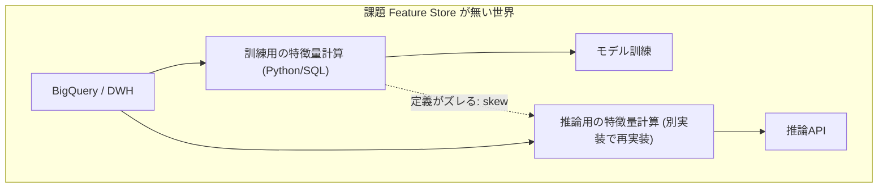
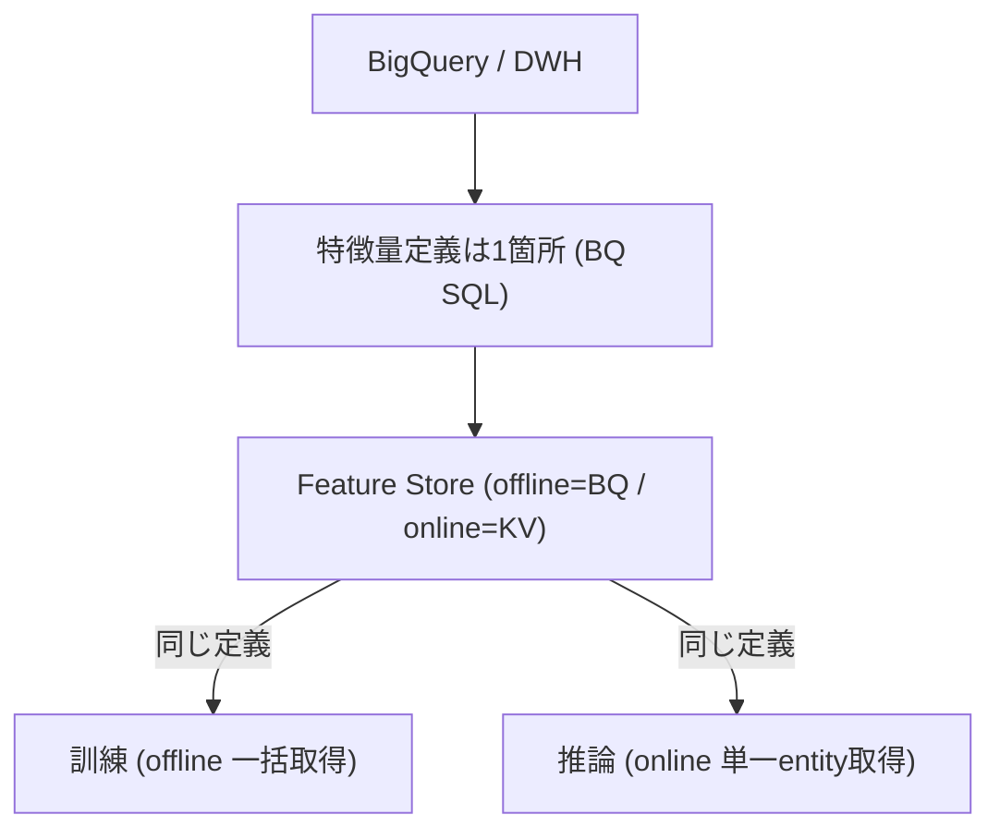
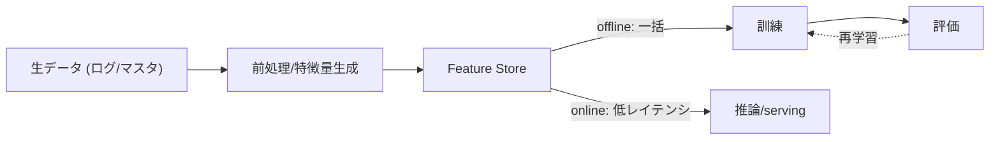
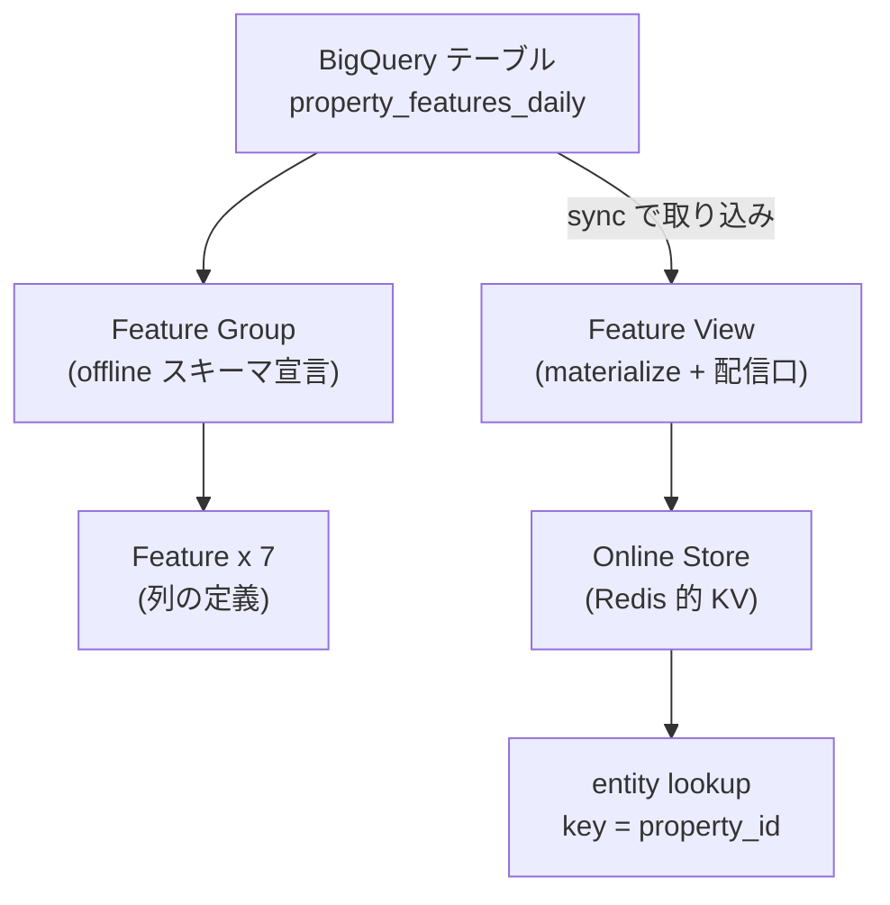
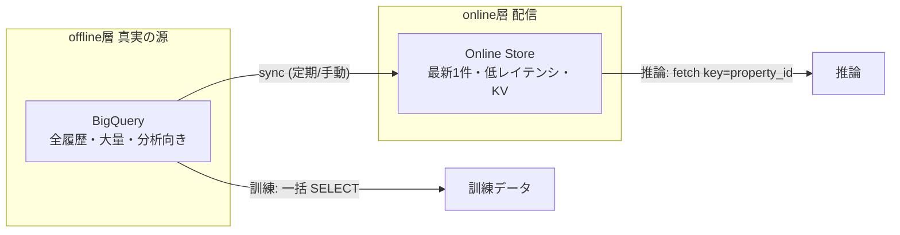
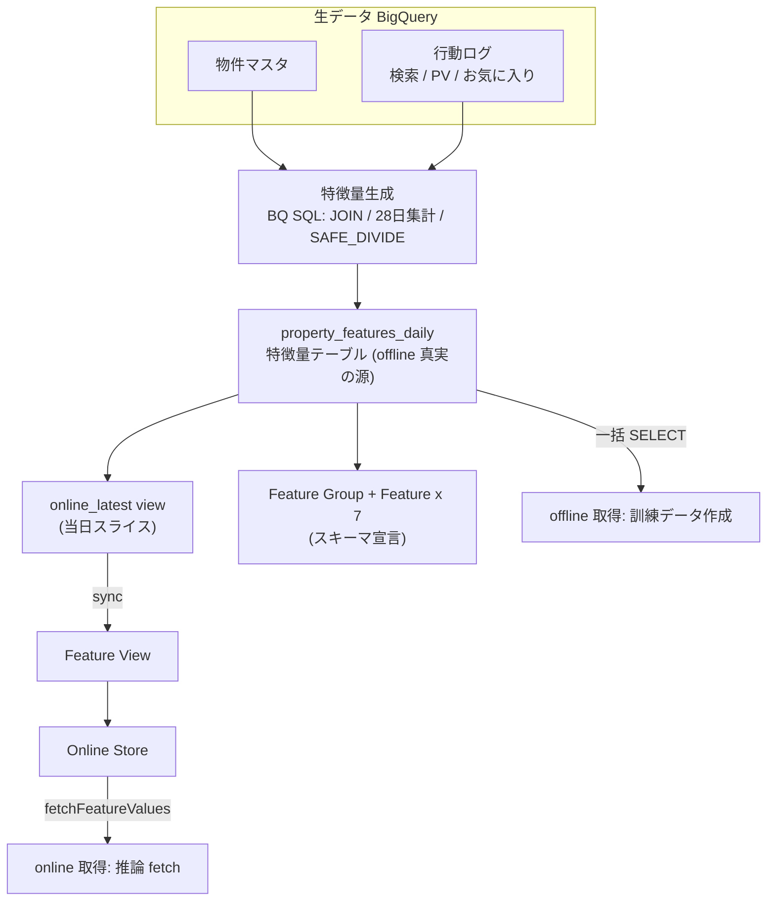
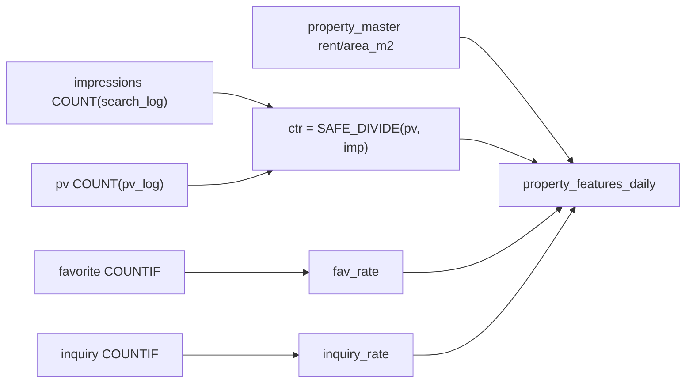
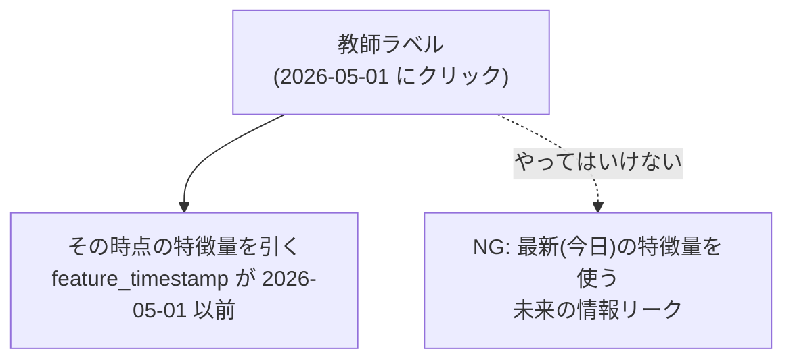
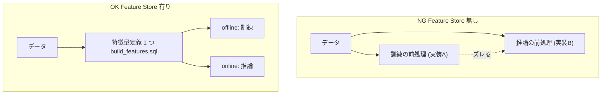
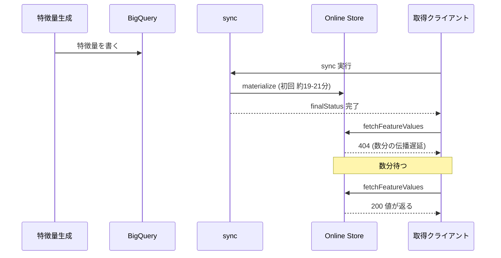

# Feature Store 入門 — 既知の技術スタックから理解する

## 1. はじめに

このドキュメントは **Vertex AI Feature Store を初めて触る人向け**の解説です。題材として本リポジトリ（study-gcp-feature-store / 不動産物件の特徴量）の実装を使い、抽象論で終わらせず「実際に何が起きるか」を示します。

**対象読者の前提（これらは説明しません。対比の足場として使います）**:
- 機械学習: モデル / 特徴量 / 訓練 / 評価 / 前処理を理解している
- GCP: BigQuery / Cloud Run job を触ったことがある
- PostgreSQL / Redis を運用したことがある
- Python / テストコードが書ける

→ なので「Feature Store とは、あなたが既に持っている **PostgreSQL + Redis + 前処理パイプライン**を、機械学習の特徴量管理に特化してマネージド化したもの」という視点で読み進めてください。

> 仕様は [01_仕様書.md](01_仕様書.md)、実装の詳細は [02_実装カタログ.md](02_実装カタログ.md)、運用は [03_運用.md](03_運用.md)。

---

## 2. Feature Store は何の課題を解くのか

機械学習で特徴量を扱うとき、Feature Store **無し**だとこうなりがちです。

代表的な 3 つの痛み:

| # | 課題 | 具体例（あなたの経験で言うと） |
|---|---|---|
| ① | **training-serving skew** | 訓練は pandas で `ctr = clicks/impressions`、推論は Go で実装し直して丸め方が違う → モデルが本番で劣化。**「訓練と推論で同じ前処理コードを2回書く」問題** |
| ② | **特徴量の再利用 / 重複実装** | `ctr` を 3 つのモデルがそれぞれ別 SQL で計算。誰の定義が正か分からない |
| ③ | **offline/online 一貫性 + point-in-time** | 訓練は大量バッチ（BQ で全件）、推論は 1 件を数ミリ秒で（Redis 的）。両方に「同じ値」を届けたい。さらに訓練時は**過去のその時点**の特徴量が要る（リーク防止） |

Feature Store **有り**の世界:

→ **特徴量の定義・保存・配信を一元化**し、訓練と推論に**同じ値**を届ける。これが Feature Store の本質です。

---

## 3. 機械学習ライフサイクルの中での位置

あなたが知っている「前処理 → 訓練 → 評価 → 推論」の流れに重ねると、Feature Store は**前処理の出力を保管し、訓練と推論に配る層**です。

- 青 = **offline 経路**（訓練・評価。大量データを BigQuery から）
- オレンジ = **online 経路**（推論。1 entity を低レイテンシで）
- **Feature Store はこの分岐点に立ち、両経路へ同じ特徴量を供給**します。

> 本プロジェクトは「特徴量を Feature Store に載せ、両経路で取り出せる」ところまでを対象とし、**モデルの訓練・評価・推論 API そのものは作りません**（学習スコープ外）。上図の訓練/推論は「ここから先こう繋がる」概念図です。

---

## 4. 中核概念を既知の概念で理解する

Vertex AI Feature Store の用語は、あなたが知っている DB / キャッシュの概念にほぼ対応します。

| Feature Store 用語 | 既知の概念での対応 | 本プロジェクトでの実体 |
|---|---|---|
| **Entity** | テーブルの「主体」（= 1 行が表す対象） | 物件 |
| **Entity ID** | 主キー (PK) | `property_id` |
| **Feature** | 列 / カラム | `rent`, `ctr`, `fav_rate` など 7 個 |
| **Feature Group** | 「この BQ テーブルを特徴量として登録」というメタ定義（offline 側のスキーマ宣言） | `property_features`（`feature_mart.property_features_daily` を登録） |
| **Online Store** | **Redis 的な低レイテンシ KV ストア**（key=Entity ID で値を引く） | `mlops_dev_feature_store`（Optimized） |
| **Feature View** | offline テーブル → Online Store への **materialized view + 配信口** | `property_features` |
| **sync** | ETL + キャッシュウォーム（offline → online へ取り込み） | `make sync`（Cloud Run job） |
| **feature_timestamp** | 「いつ時点の特徴量か」= point-in-time キー | `feature_timestamp` 列 |

概念の関係:

ポイント: **Feature Group は「定義・メタデータ」担当**（ここから直接 online 取得はできない）。**実際に低レイテンシで引けるのは Feature View 経由の Online Store** です。

---

## 5. offline と online の二層 — ここが本質

Feature Store の肝は「**同じ特徴量を 2 つの形で持つ**」ことです。

**Redis を自前運用している人向けの一言**:

> Online Store は「**Redis キャッシュ + cron での同期ジョブ + スキーマ管理 + Entity ID 設計**を、自分で組まずにマネージドで手に入れたもの」です。あなたが「PostgreSQL を真実の源にして、Redis に最新値をキャッシュし、cron で同期する」構成を組むなら、それを ML 特徴量向けに製品化したのが offline(BQ)/online(Online Store) の二層だと考えてください。

なぜ二層が要るか:
- **訓練**は数百万行を一括で読む → 列指向の BigQuery が最適（KV では遅い）。
- **推論**は「この物件1件の特徴量を 10ms で」→ KV ストアが最適（BQ クエリでは遅い・高い）。
- 片方だけだと必ずどちらかが破綻する。だから両方持ち、**sync で一致させる**。

---

## 6. 本プロジェクトで具体化（worked example）

不動産物件 `property_features` を題材に、生データから online 取得までの全体像です。

各要素と §4 概念の対応:

| 本プロジェクト | 概念 |
|---|---|
| `property_features_daily` | offline の真実の源（BQ テーブル） |
| Feature Group + Feature×7 | スキーマ宣言（offline メタ） |
| `online_latest`(view) | Feature View が読む source（当日 1 行/物件） |
| Feature View → Online Store | online 配信（Redis 的 KV） |
| sync | offline → online 取り込み |

> Entity ID は `property_id`、Feature は `rent / walk_min / age_years / area_m2 / ctr / fav_rate / inquiry_rate` の 7 個。実際の構築・実行コマンドは [03_運用.md](03_運用.md) を参照。

---

## 7. あなたの ML ノウハウと結びつける（核心）

### 7.1 前処理 / 特徴量生成 = BigQuery SQL
あなたが pandas/scikit-learn でやる前処理は、ここでは **BigQuery SQL**（[app/data/sql/build_features.sql](../app/data/sql/build_features.sql)）に対応します。

| 前処理の概念 | この SQL での対応 |
|---|---|
| 集計 (groupby + count) | `COUNT(*)`, `COUNTIF(action='favorite')` |
| 期間集計 (rolling window) | 直近 28 日 `WHERE timestamp >= window_start` |
| 欠損補完 / ゼロ除算回避 | `SAFE_DIVIDE(pv, imp)`（0 除算は NULL）、`COALESCE(x, 0)` |
| 全件保持 (左外部結合) | `LEFT JOIN`（行動ゼロの物件も残す。例: p006） |

### 7.2 特徴量設計の型
- **behavioral（行動ベース）**: `ctr` / `fav_rate` / `inquiry_rate` = アクション数 / impression 数。分母 0 を NULL にして「データ不足」を区別。
- **static（属性ベース）**: `rent` / `area_m2` など物件マスタの値。
- これらを 1 テーブル（`property_features_daily`）に揃え、Entity ID `property_id` で引けるようにするのが Feature Store 流。

### 7.3 訓練 (offline) と feature_timestamp = リーク防止
訓練データは offline（BQ）から作ります。重要なのが **`feature_timestamp`（point-in-time）**:

> ラベルの時刻より**未来の特徴量**を使うとデータリーク（target leakage）になり、評価が過大に出ます。`feature_timestamp` は「いつ時点の値か」を持たせ、訓練時に**過去のその時点の値**を join するための鍵です。SQL で言えば `JOIN ... ON feature.feature_timestamp <= label.event_time` の世界。本プロジェクトは訓練しませんが、この列を持たせてあるのはこのためです。

### 7.4 推論 (online) と training-serving skew の防止
serving は Online Store から `fetchFeatureValues(key=property_id)` で引きます。**訓練と推論で同じ特徴量定義（同じ SQL の出力）を共有**するため、skew が原理的に消えます。

---

## 8. 実務ノウハウ / 落とし穴（本プロジェクトで実際に踏んだもの）

実機検証（2026-05-20）で遭遇した、ドキュメントに書かれにくい現実です。

- **初回 sync は約 19〜21 分**かかる。Optimized Online Store の serving ノード（min 2）初期プロビジョニング + 初回 materialize のため。**2 回目以降は数分**。
- **sync 完了 ≠ online 取得可**。sync が `finalStatus=完了` でも、**直後の数分間は `fetchFeatureValues` が全 entity 404**（serving ノードへの伝播遅延）。

- → online 一括取得は **404 を graceful に skip / retry** すること。未 materialize の entity（全特徴量 NULL の行など）も 404 になりうる。
- **Optimized Online Store はノード常駐課金**。使い終わったら撤去する。一時停止だけなら Online Store / Feature View だけ落とす手もある。
- **gcloud に `gcloud ai feature-*` が無い**（SDK 563.x）。Feature Store の操作・確認は Vertex AI **REST API** を使う。
- **出力スキーマを既存と一致させれば Feature Group / Feature View は無変更**で、特徴量テーブルの中身だけ差し替えられる。
- Cloud Run job は `deletion_protection` デフォルト true → `false` を明示しないと `make destroy` が失敗する。

---

## 9. いつ使う / いつ使わないか

Feature Store は強力ですが、すべての案件で必要なわけではありません。PostgreSQL + Redis ベースの構成で要件を満たせるケースも多く、導入是非は規模・体制・要件から判断します。

| Feature Store が効く | 自前 PG + Redis で十分（オーバーキル） |
|---|---|
| 複数モデル / 複数チームで**特徴量を共有・再利用**したい | モデルが 1 つで特徴量も少数 |
| **training-serving skew** が実際に問題になっている | 前処理が単純で訓練=推論が自明 |
| **point-in-time** の正確な訓練データが必要 | 時系列リークの懸念が小さい |
| online 低レイテンシ配信を**マネージド**で欲しい | 既に Redis 運用が回っていて要件を満たす |
| 特徴量の**カタログ / メタデータ管理**が欲しい | スプレッドシート管理で足りる規模 |

> 目安: 「特徴量の再実装で skew が出た」「複数モデルで同じ特徴量を別々に作っている」「point-in-time join を自前で書くのが辛い」のどれかに当てはまったら導入価値が高い。そうでなければ PG + Redis の方が安くて速いこともある。

---

## 10. 用語集（既知技術との対訳）

| Feature Store | ≒ 既知の概念 |
|---|---|
| Entity ID | 主キー (PK) |
| Feature | 列 / カラム |
| Feature Group | 「このテーブルを特徴量として登録」したメタ定義 |
| Online Store | Redis 的な低レイテンシ KV ストア |
| Feature View | offline → online の materialized view + 配信口 |
| offline store | 真実の源（BigQuery / DWH） |
| sync | ETL + キャッシュウォーム |
| fetchFeatureValues | `GET key` 相当（key = Entity ID） |
| feature_timestamp | point-in-time キー（いつ時点の値か） |
| training-serving skew | 訓練と推論で前処理がズレてモデル劣化する問題 |

---

## 11. 次に読む

- [01_仕様書.md](01_仕様書.md) — 目的・アーキテクチャ・スキーマ・スコープ
- [02_実装カタログ.md](02_実装カタログ.md) — リソース/コード構成・検証結果・設計判断
- [03_運用.md](03_運用.md) — コマンド・フロー・所要時間・落とし穴・teardown
